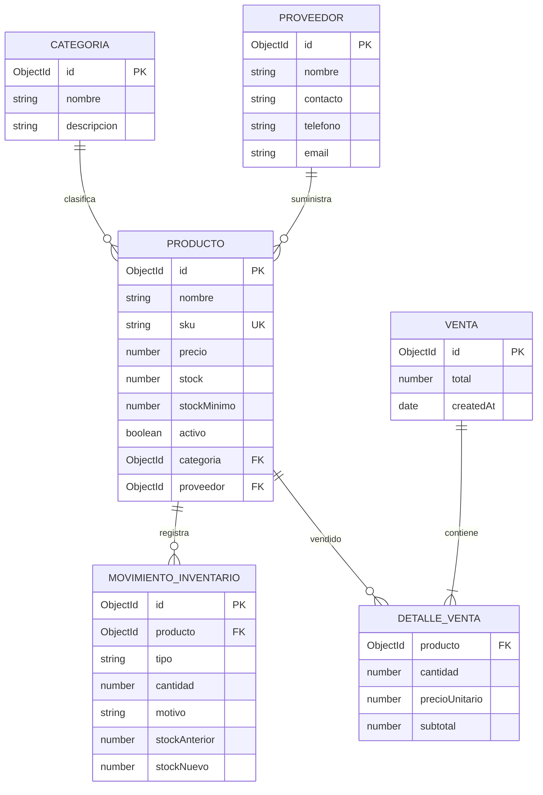

# Diagrama de base de datos

MongoDB almacena cada detalle dentro del documento `Venta`; se muestra como entidad separada para explicar la relación lógica. Todas las colecciones incluyen `createdAt` y `updatedAt` automáticos.
