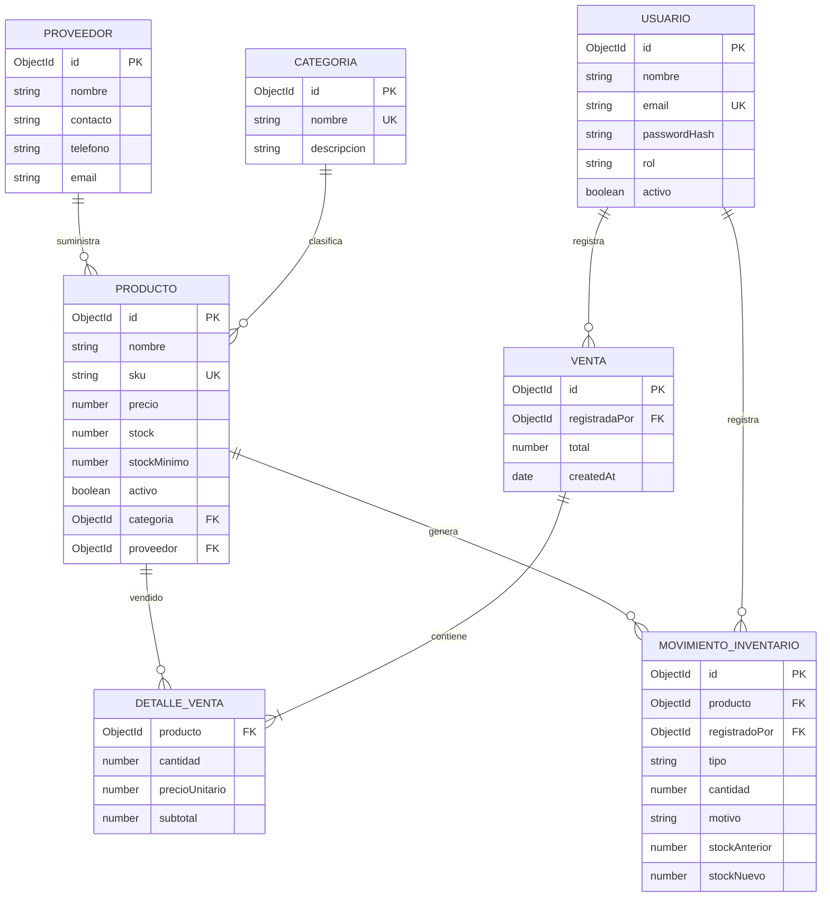

# Diagrama de base de datos

Los detalles se guardan dentro del documento de venta; se separan en el diagrama para mostrar su relación con productos. Mongoose agrega `createdAt` y `updatedAt` a las colecciones.
